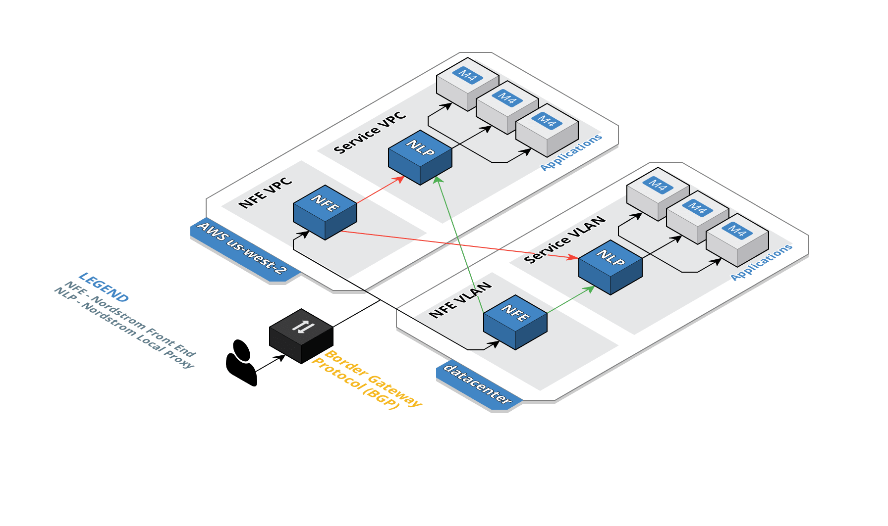
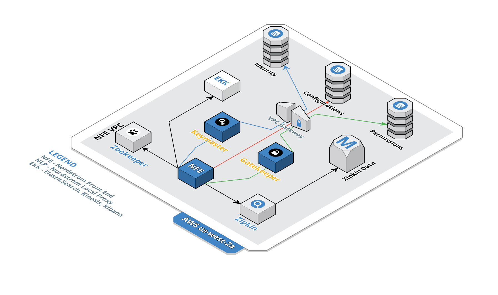
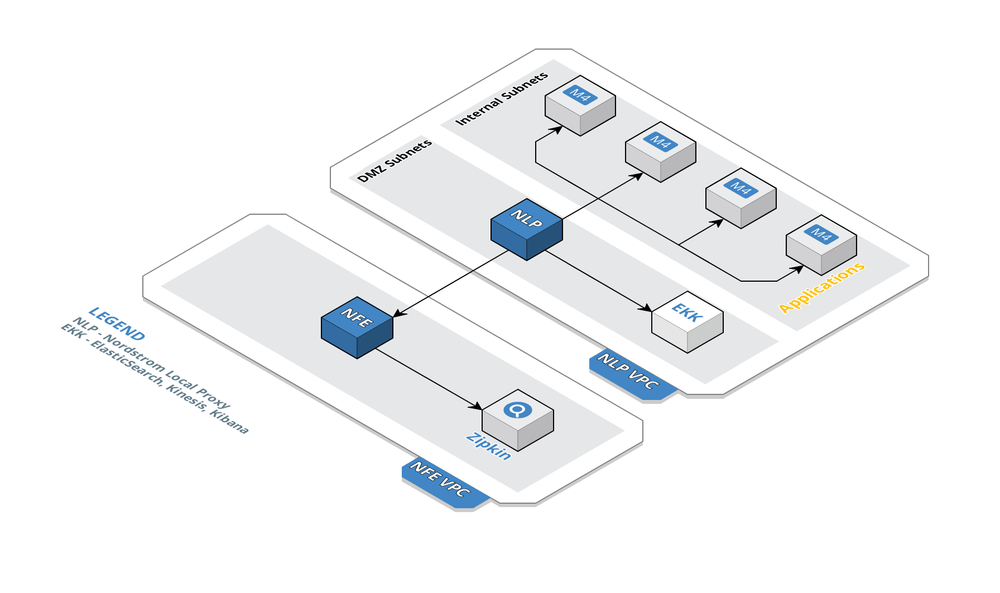

# Global Traffic Management

## Table of Contents

* [Overview](#overview)

* [Design](#design)

  * [GTM](#gtm)

  * [NFE Detailed View](#nfe-detailed-view)

  * [NLP Detailed View](#nlp-detailed-view)

* [Contributors](#contributors)

* [License](#license)

## Overview

Global Traffic Management (GTM) is Nordstrom's answer to the following developer needs that get in the way of focus on features for their business stakeholders:

* I need an easy, effective, efficient, reliable way to expose my service as a public endpoint.

* I need zero-trust security for my service.

* I need a Business Continuity and Disaster Recovery (BCDR) solution for my service.

GTM is neither a service mesh network nor a gateway service. GTM is a hybrid solution that is one-third service mesh network, one-third Google Front End-style (GFE) load balancing gateway, and one-third web application firewall.

## Design

### GTM

GTM is comprised of two main components, the Nordstrom Front End (NFE) and the Nordstrom Local Proxy (NLP).

The diagram above shows:

* A service makes a call to https://api.yourdomain.com/foo/bar, where foo is a project/team and bar is a service. Border Gateway Protocol (BGP) determines which Nordstrom Front End (NFE) will answer the call based on proximity and availability (e.g., if us-west-2 is closer but is totally down due to earthquake, route to us-east-2).

* The answering NFE determines which Nordstrom Local Proxy (NLP) will answer the call based on a variety of factors, one of which is whether or not the caller is allowed to call based on mutual auth/TLS.

* The NLP supports ingress and load-balancing of individual service nodes, so one node can respond—or maybe multiple nodes will respond if routing logic demands it.

### NFE Detailed View

NFE has four main supporting components: Keymaster, Gatekeeper, Zookeeper, and Zipkin.

### NLP Detailed View

## Contributors

A list of the people who were involved in the creation of GTM can be found in the [contributors](CONTRIBUTORS.md) document.

## License

GTM is licensed under the [Apache 2.0 license](LICENSE).