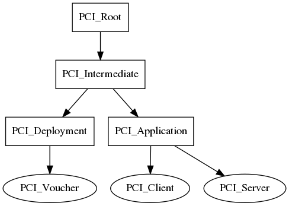
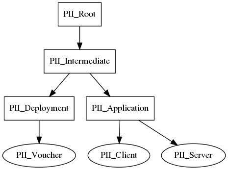
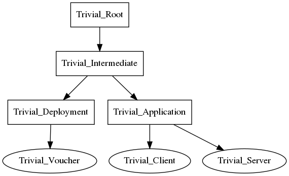
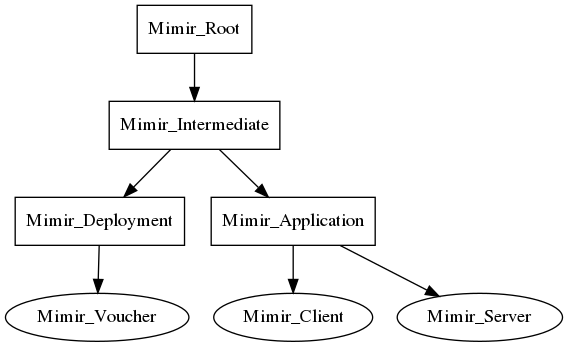

# Overview

GTM supports multiple CA roots, this allows us to categorize and separate different types of traffic. The currently supported roots are:

* PCI
* PII
* Trivial
* Mimir

## PCI

For PCI traffic

## PII

For PII traffic

## Trivial

For non PCI/PII traffic

## [Mimir](https://en.wikipedia.org/wiki/M%C3%ADmir)

For "god-mode" traffic between the NFE and NLP.

# Certificate Tree Structure

Every CA root has an Intermediate issued beneath it. 
This allows us to burn the Intermediate instead of the root. 
There may be multiple Intermediates active at any given point. 
For instance to allow a seamless transition from Intermediate A to Intermediate B, we would need both to be active.

The Intermediate issues Deployment and Application certificates. 
This allows us to differentiate between Client/Server certificates and Deployment_Vouchers.

The Application certificate issues both Client and Server certificates.
Services should only ever be handling Deployment_Voucher, Client, and Server certificate pairs.

## Certificate Actors and Use Cases

### CA Root

The CA Root's private key material should only be handled by the Certificate Authority to generate Intermediate certificate pairs.

### Intermediate

The Intermediate's private key material should only be handled by the Certificate Authority to generate Deployment and Application certificate pairs.

### Deployment

The Deployment's private key material should only be handled by Keymaster to generate Deployment_Voucher certificate pairs.

### Voucher

The Voucher's private key material will be generated by Keymaster and handed off to an authorized service.
The authorized service may hand off this material to another service on who's behalf it has performed the Keymaster request.

### Application

The Application's private key material should only be handled by Keymaster to generated Client and Server certificate pairs.

### Client

The Client's private key material will be generated by Keymaster and handed off to an authorized service.
The authorized service should not share this material.

### Server

The Server's private key material will be generated by Keymaster and handed off to an authorized service.
The authorized service should not share this material.

## Diagrams

The following diagrams are generated with graphviz.  Install graphviz locally and run `make` to produce the pngs.

### Source
The template .dot file is [pci_root.dot](pci_root.dot).  You can render it in a browser with [viz-js](http://viz-js.com/).

### PCI

### PII

### Trivial

### Mimir

